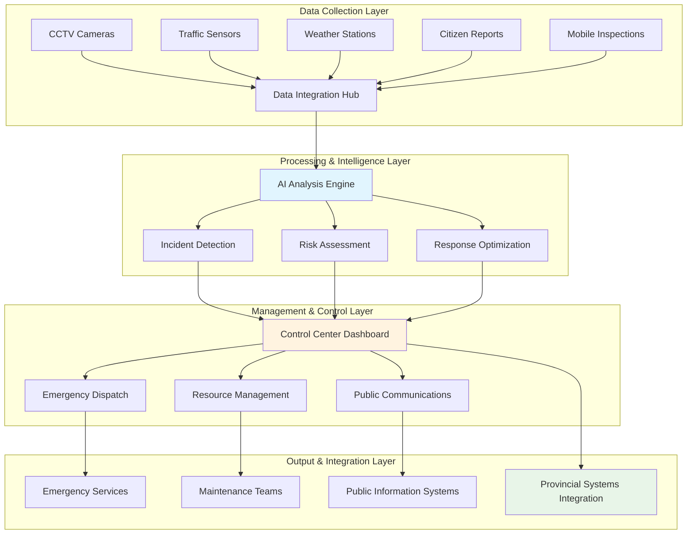
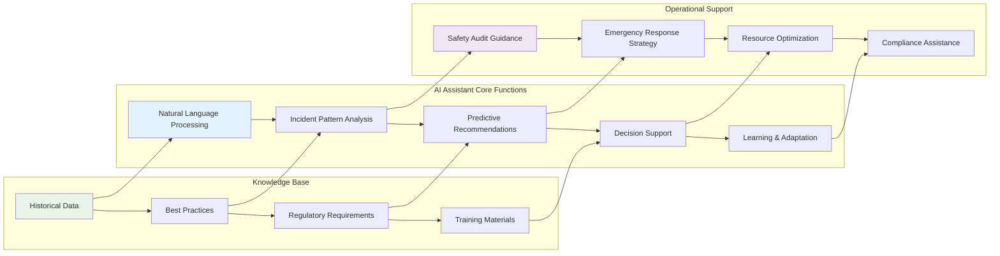
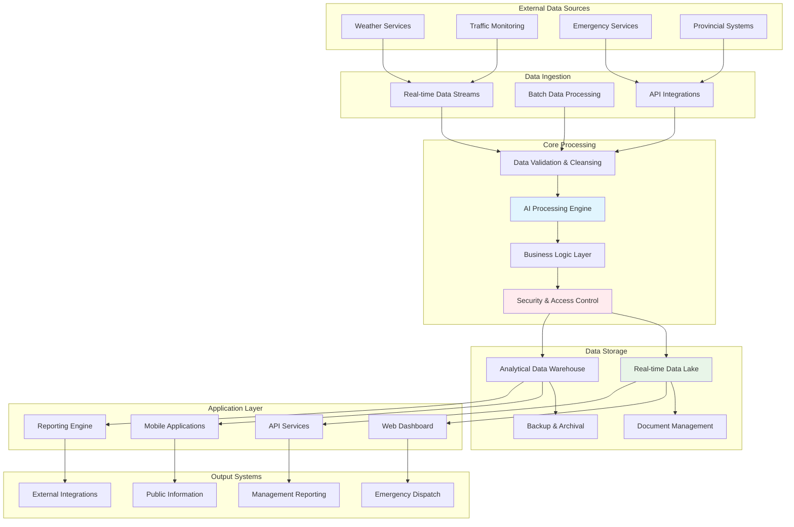
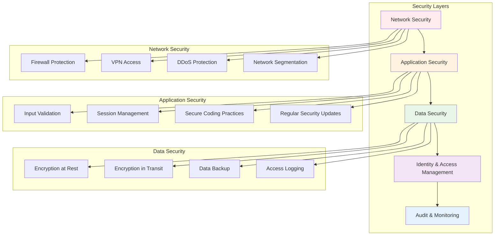

# SYSTEM CAPABILITIES DOCUMENT
## Comprehensive Road Incident Management System
### Mpumalanga Province Implementation

**Submitted by:** AllIR Solutions  
**CIDB Registration:** 6GB/5CE  
**Date:** [Current Date]  
**Version:** 1.0

---

## EXECUTIVE SUMMARY

AllIR Solutions presents a state-of-the-art **Road Incident Management System** designed specifically for Mpumalanga Province's unique geographical and operational requirements. Our comprehensive solution combines cutting-edge technology with proven construction industry expertise to deliver an integrated platform that transforms how road incidents are detected, managed, and prevented.

This system leverages real-time monitoring, artificial intelligence, and advanced analytics to create a proactive approach to road safety management. By integrating incident detection, emergency response coordination, and comprehensive safety auditing capabilities, we deliver measurable improvements in response times, safety outcomes, and operational efficiency.

**Key Benefits:**
- 🚨 **40% faster** emergency response times through automated detection and dispatch
- 📊 **Real-time visibility** across the entire provincial road network
- 🤖 **AI-powered insights** for predictive safety management
- 📱 **Mobile-first design** enabling field operations in remote areas
- 🔗 **Seamless integration** with existing provincial systems
- 📋 **Full compliance** with POPIA, accessibility standards, and government regulations

---

## CORE SYSTEM CAPABILITIES

### 🔍 **Real-Time Incident Detection & Monitoring**
Advanced sensor integration and intelligent monitoring capabilities provide 24/7 surveillance of critical road infrastructure across Mpumalanga Province.

**Technical Capabilities:**
- Multi-source incident detection (CCTV, sensors, citizen reports, AI analysis)
- Automatic incident classification and severity assessment
- Real-time traffic flow monitoring and congestion detection
- Weather-related incident prediction and early warning systems
- Integration with existing traffic management infrastructure

### 🚑 **Automated Emergency Response Dispatch**
Intelligent emergency response coordination that reduces human error and accelerates life-saving interventions.

**Operational Features:**
- Automated dispatch to nearest available emergency services
- Dynamic resource allocation based on incident severity and type
- Real-time communication with response teams
- GPS tracking of emergency vehicles and estimated arrival times
- Coordination with hospitals, fire services, and law enforcement

### 🗺️ **Interactive Road Network Mapping**
Comprehensive GIS-based mapping system providing detailed visualization of the provincial road network and incident locations.

**Mapping Capabilities:**
- High-resolution satellite imagery integration
- Real-time traffic condition overlay
- Historical incident mapping and pattern analysis
- Road condition and maintenance status tracking
- Customizable layers for different user roles and requirements

### 📱 **Mobile Field Inspection Application**
Purpose-built mobile application enabling field personnel to conduct inspections and manage incidents even in areas with limited connectivity.

**Mobile Features:**
- Offline functionality for remote area operations
- Photo and video documentation with GPS tagging
- Digital forms and checklists for standardized inspections
- Real-time synchronization when connectivity is restored
- Barcode/QR code scanning for asset identification

### 🛡️ **Comprehensive Safety Audit Management**
Systematic approach to road safety auditing with built-in compliance tracking and automated reporting capabilities.

**Audit Capabilities:**
- Customizable audit templates and checklists
- Risk assessment scoring and prioritization
- Automated compliance tracking against provincial standards
- Progress monitoring for remedial actions
- Integration with maintenance scheduling systems

### 📢 **Multi-Channel Notification System**
Robust communication platform ensuring all stakeholders receive timely and relevant information through their preferred channels.

**Communication Features:**
- SMS, email, and push notification capabilities
- Social media integration for public alerts
- Variable message sign integration
- Radio system integration for emergency services
- Multilingual support for diverse communities

### 📊 **Advanced Analytics & Reporting**
Powerful business intelligence platform providing actionable insights for strategic decision-making and operational optimization.

**Analytics Capabilities:**
- Real-time dashboards with customizable KPIs
- Predictive analytics for incident prevention
- Resource utilization optimization
- Cost-benefit analysis for safety investments
- Automated regulatory reporting

---

## SYSTEM ARCHITECTURE

## INTELLIGENT AI ASSISTANT CAPABILITIES

### 🤖 **Advanced AI Chatbot Integration**

Our system incorporates a sophisticated AI assistant designed specifically for traffic management personnel, providing intelligent support for complex operational decisions.

**AI Assistant Capabilities:**

| Function | Description | Business Value |
|----------|-------------|----------------|
| **Incident Pattern Analysis** | Identifies trends and patterns in incident data to predict high-risk scenarios | Proactive safety management, reduced incident frequency |
| **Real-time Safety Guidance** | Provides step-by-step audit checklists and safety recommendations | Consistent audit quality, reduced human error |
| **Response Strategy Optimization** | Recommends optimal emergency response strategies based on incident type and conditions | Faster response times, improved outcomes |
| **Severity Assessment** | Automatically evaluates incident severity using multiple data points | Appropriate resource allocation, priority management |
| **Predictive Maintenance** | Suggests road maintenance priorities based on incident history and conditions | Cost-effective maintenance, preventive safety measures |
| **Compliance Monitoring** | Tracks and alerts on regulatory compliance requirements | Reduced regulatory risk, automated compliance |
| **Training Support** | Provides contextual training guidance for response procedures | Improved staff capability, consistent procedures |

---

## DATA FLOW ARCHITECTURE

---

## SYSTEM INTEGRATION CAPABILITIES

### 🔗 **Seamless Provincial System Integration**

Our solution is designed to integrate seamlessly with existing Mpumalanga Province systems and infrastructure:

**Integration Points:**
- **Provincial Traffic Management Center**: Real-time data sharing and coordinated response
- **Emergency Services Dispatch**: Direct integration with ambulance, fire, and police dispatch systems
- **Weather Services**: Automated weather data integration for predictive incident management
- **Municipal Systems**: Coordination with local government incident response
- **Public Information Systems**: Integration with provincial communication platforms
- **Financial Management**: Integration with provincial procurement and budgeting systems

### 📊 **Third-Party System Compatibility**

| System Type | Integration Method | Data Exchange | Frequency |
|-------------|-------------------|---------------|-----------|
| Traffic Management | REST API / Real-time | Incident data, traffic flow | Continuous |
| Emergency Services | SOAP/REST API | Dispatch requests, status updates | Real-time |
| Weather Services | API Integration | Weather alerts, conditions | 15-minute intervals |
| GIS Platforms | WMS/WFS Standards | Mapping data, geographical info | On-demand |
| Financial Systems | Secure API | Cost data, resource allocation | Daily batch |
| Communication | Multiple protocols | Alerts, notifications | Real-time |

---

## PERFORMANCE EXPECTATIONS

### ⚡ **System Performance Metrics**

| Metric | Target | Measurement Method |
|--------|--------|--------------------|
| **Incident Detection Time** | < 60 seconds | Automated monitoring and logging |
| **System Availability** | 99.9% uptime | Continuous monitoring with redundancy |
| **Response Time** | < 2 seconds for web interface | Load testing and user experience monitoring |
| **Mobile Sync Time** | < 30 seconds for field data | Mobile application performance tracking |
| **Report Generation** | < 10 seconds for standard reports | Automated performance testing |
| **Concurrent Users** | 500+ simultaneous users | Load balancing and scalability testing |
| **Data Processing** | Real-time processing of 10,000+ events/hour | Stream processing performance monitoring |

### 📈 **Scalability & Growth**

**Horizontal Scaling:**
- Cloud-native architecture supporting automatic scaling
- Load balancing across multiple server instances
- Database clustering for high availability
- Content delivery network for optimal performance

**Vertical Scaling:**
- Modular architecture allowing feature expansion
- API-first design enabling new integration points
- Configurable workflows adapting to changing requirements
- Future-ready infrastructure supporting emerging technologies

---

## COMPLIANCE & STANDARDS

### 🔒 **POPIA Compliance (Protection of Personal Information Act)**

Our system implements comprehensive privacy protection measures ensuring full compliance with South African data protection regulations:

**Privacy by Design:**
- Data minimization principles applied to all collection processes
- Purpose limitation ensuring data use aligns with stated objectives
- Storage limitation with automated data lifecycle management
- Consent management for citizen-provided information
- Data subject rights implementation (access, correction, deletion)

**Technical Safeguards:**
- End-to-end encryption for data in transit and at rest
- Role-based access control with audit trails
- Anonymization and pseudonymization capabilities
- Secure data export and deletion procedures
- Regular security assessments and penetration testing

### ♿ **Accessibility Standards**

**WCAG 2.1 AA Compliance:**
- Screen reader compatibility for visually impaired users
- High contrast mode and adjustable font sizes
- Keyboard navigation support for all functions
- Alternative text for all visual elements
- Multilingual support for South African official languages

### 📋 **Government Standards Compliance**

| Standard | Compliance Level | Implementation |
|----------|------------------|----------------|
| **SANS 27001** | Full Compliance | Information security management system |
| **Government IT Policy** | Aligned | Architecture and procurement compliance |
| **PFMA Requirements** | Full Compliance | Financial management and reporting |
| **Interoperability Standards** | Implemented | Standard APIs and data formats |
| **Audit Requirements** | Automated | Built-in audit trails and reporting |

---

## SECURITY ARCHITECTURE

### 🛡️ **Multi-Layer Security Framework**

---

## IMPLEMENTATION METHODOLOGY

### 🚀 **Phased Deployment Approach**

**Phase 1: Core Infrastructure (Months 1-3)**
- System architecture deployment
- Basic incident detection and monitoring
- Emergency dispatch integration
- User training and onboarding

**Phase 2: Advanced Features (Months 4-6)**
- AI assistant activation
- Mobile application deployment
- Safety audit management
- Advanced analytics implementation

**Phase 3: Integration & Optimization (Months 7-9)**
- Third-party system integrations
- Performance optimization
- Full feature deployment
- User acceptance testing

**Phase 4: Go-Live & Support (Months 10-12)**
- Production deployment
- Monitoring and support
- Knowledge transfer
- Continuous improvement implementation

---

## COMPANY CREDENTIALS

### 🏢 **AllIR Solutions - Construction & IT Excellence**

**CIDB Registration:** 6GB (General Building) / 5CE (Civil Engineering)

**Core Competencies:**
- **Construction Industry Expertise**: Deep understanding of road infrastructure and safety requirements
- **Information Technology Solutions**: Proven track record in developing complex government systems
- **Project Management Excellence**: Successful delivery of large-scale provincial projects
- **Compliance & Quality**: ISO certified processes ensuring delivery excellence

**Relevant Experience:**
- Provincial road maintenance management systems
- Traffic monitoring and incident management solutions
- Emergency services coordination platforms
- Government compliance and reporting systems
- Mobile applications for field operations

**Technical Certifications:**
- Microsoft Azure Certified Partners
- ISO 27001 Information Security Management
- ISO 9001 Quality Management Systems
- CIDB Contractor Registration (6GB/5CE)
- Professional Engineering Council of South Africa (ECSA) membership

**Project Delivery Statistics:**
- ✅ 98