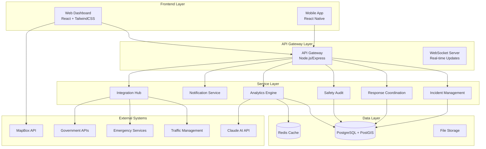
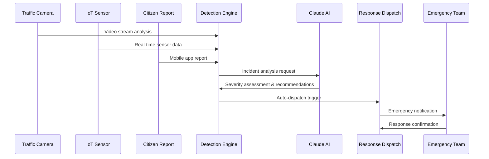
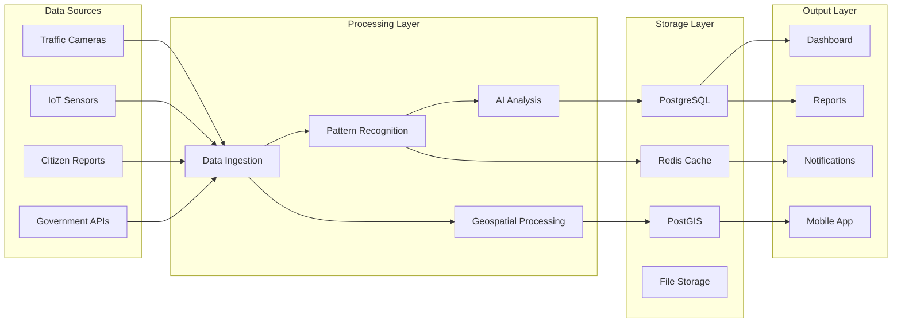

# Road Incident Management System - Technical Manual

**Version:** 1.0  
**Document Type:** Technical Manual  
**Prepared For:** South African Government Tender Submission  
**Date:** November 2024  
**Classification:** Confidential

---

## Table of Contents

1. [Executive Summary](#1-executive-summary)
2. [System Architecture](#2-system-architecture)
3. [Technology Stack](#3-technology-stack)
4. [Module Documentation](#4-module-documentation)
5. [API Reference](#5-api-reference)
6. [Database Schema](#6-database-schema)
7. [Deployment Guide](#7-deployment-guide)
8. [Security Considerations](#8-security-considerations)
9. [Monitoring & Maintenance](#9-monitoring--maintenance)
10. [Backup & Recovery](#10-backup--recovery)
11. [Compliance & Standards](#11-compliance--standards)

---

## 1. Executive Summary

The Road Incident Management System (RIMS) is a comprehensive digital platform designed to enhance road safety and incident response capabilities across South African provinces. The system integrates real-time monitoring, automated incident detection, emergency response coordination, and comprehensive safety audit management.

### 1.1 Key Features

- **Real-time Incident Detection**: Automated monitoring through traffic cameras, IoT sensors, and citizen reporting
- **Emergency Response Coordination**: Streamlined dispatch and resource allocation
- **Safety Audit Management**: Comprehensive inspection scheduling and compliance tracking
- **Geospatial Mapping**: Interactive road network visualization with incident overlay
- **Analytics Dashboard**: Real-time KPIs, trend analysis, and performance monitoring
- **Mobile Field Application**: Offline-capable app for field inspectors and response teams
- **Multi-channel Notifications**: SMS, email, and push notification system
- **Integration Hub**: Seamless connectivity with existing traffic management and emergency systems

### 1.2 Compliance Standards

- POPIA (Protection of Personal Information Act) compliant
- SANS 27001/27002 information security standards
- Municipal Systems Act compliance
- National Road Traffic Act adherence

---

## 2. System Architecture

### 2.1 High-Level Architecture



### 2.2 Incident Detection Flow



### 2.3 Data Flow Architecture



---

## 3. Technology Stack

### 3.1 Core Technologies

| Component | Technology | Version | Purpose |
|-----------|------------|---------|---------|
| Backend Framework | Node.js/Express | 18.x/4.x | RESTful API and business logic |
| Frontend Framework | React | 18.x | User interface development |
| CSS Framework | TailwindCSS | 3.x | Responsive styling |
| Database | PostgreSQL | 14.x | Primary data storage |
| Geospatial Extension | PostGIS | 3.x | Geographic data processing |
| Mobile Framework | React Native | 0.72.x | Cross-platform mobile app |
| Caching | Redis | 7.x | Session management and caching |
| Message Queue | Redis/Bull | 4.x | Background job processing |

### 3.2 External Services

| Service | Provider | Purpose |
|---------|----------|---------|
| AI Analysis | Claude API | Incident analysis and safety recommendations |
| Mapping | MapBox GL JS | Interactive mapping and visualization |
| Real-time Updates | WebSocket | Live incident status updates |
| File Storage | AWS S3/Compatible | Document and media storage |
| Email Service | SendGrid/AWS SES | Email notifications |
| SMS Service | Twilio/AWS SNS | SMS alerts |

### 3.3 Development Tools

- **Version Control**: Git with GitLab/GitHub
- **CI/CD**: GitLab CI or GitHub Actions
- **Testing**: Jest, Cypress, React Testing Library
- **Code Quality**: ESLint, Prettier, SonarQube
- **Documentation**: Swagger/OpenAPI, JSDoc
- **Monitoring**: Prometheus, Grafana, Winston logging

---

## 4. Module Documentation

### 4.1 Incident Detection Module

**Purpose**: Real-time monitoring and automatic incident detection using traffic cameras, sensors, and citizen reports.

**Key Files**:
- `src/detection/sensors.js` - IoT sensor data processing
- `src/detection/camera-analysis.js` - Video stream analysis
- `src/detection/pattern-recognition.js` - Pattern matching algorithms

**Functions**:
```javascript
// Sensor data processing
processSensorData(sensorId, dataPoint)
validateSensorReading(reading)
triggerIncidentAlert(sensorData)

// Camera analysis
analyzeVideoStream(cameraId, streamData)
detectAnomalies(videoFrame)
classifyIncidentType(analysisResult)

// Pattern recognition
identifyTrafficPattern(historicalData)
detectCongestionAnomalies(currentTraffic)
predictIncidentProbability(patterns)
```

### 4.2 Incident Management Module

**Purpose**: Complete incident lifecycle management from creation to resolution.

**Key Files**:
- `src/incident/crud.js` - CRUD operations for incidents
- `src/incident/workflow.js` - Incident workflow management
- `src/incident/priority-calculator.js` - Priority scoring algorithm

**Core Features**:
- Incident creation, update, and tracking
- Status workflow management (Open → In Progress → Resolved → Closed)
- Priority calculation based on severity, location, and traffic impact
- Evidence collection and documentation

### 4.3 Response Coordination Module

**Purpose**: Emergency response coordination with dispatch, resource allocation, and communication.

**Key Files**:
- `src/response/dispatch.js` - Emergency dispatch system
- `src/response/resources.js` - Resource allocation management
- `src/response/communication.js` - Communication protocols

**Capabilities**:
- Automated emergency service dispatch
- Resource optimization and allocation
- Real-time team coordination
- Response time tracking and optimization

### 4.4 Safety Audit Module

**Purpose**: Road safety audit management with inspection scheduling, reporting, and compliance tracking.

**Key Files**:
- `src/audit/scheduler.js` - Audit scheduling system
- `src/audit/checklist.js` - Inspection checklist management
- `src/audit/reporting.js` - Audit report generation

**Features**:
- Automated audit scheduling based on risk assessment
- Digital inspection checklists with photo evidence
- Compliance tracking and reporting
- Corrective action management

### 4.5 Geospatial Mapping Module

**Purpose**: Interactive road network mapping with incident overlay and route optimization.

**Key Files**:
- `src/mapping/road-network.js` - Road network data management
- `src/mapping/incident-overlay.js` - Incident visualization
- `src/mapping/routing.js` - Route optimization

**Functionality**:
- Real-time road network visualization
- Incident location mapping and clustering
- Traffic flow analysis and alternative route suggestions
- Geofencing for automated alerts

### 4.6 Analytics Dashboard Module

**Purpose**: Real-time monitoring dashboard with KPIs, trends analysis, and reporting.

**Key Files**:
- `src/analytics/dashboard.js` - Dashboard data aggregation
- `src/analytics/kpi-calculator.js` - KPI calculation engine
- `src/analytics/trend-analysis.js` - Statistical analysis

**Metrics Tracked**:
- Response time averages
- Incident resolution rates
- Safety audit compliance scores
- Traffic pattern analysis

### 4.7 Notification System Module

**Purpose**: Multi-channel alert system for stakeholders including SMS, email, and push notifications.

**Key Files**:
- `src/notifications/alerts.js` - Alert management system
- `src/notifications/channels.js` - Communication channel handlers
- `src/notifications/templates.js` - Message template engine

**Channels Supported**:
- SMS notifications via Twilio/AWS SNS
- Email alerts via SendGrid/AWS SES
- Push notifications for mobile apps
- Web browser notifications

### 4.8 Mobile Field App Module

**Purpose**: Mobile application for field inspectors and response teams.

**Key Files**:
- `mobile/src/inspector-app.js` - Main mobile application
- `mobile/src/offline-sync.js` - Offline data synchronization
- `mobile/src/photo-upload.js` - Media upload functionality

**Features**:
- Offline-capable incident reporting
- GPS location tracking
- Photo and video evidence collection
- Digital signature capture

### 4.9 Reporting Engine Module

**Purpose**: Automated report generation for compliance, performance metrics, and audit trails.

**Key Files**:
- `src/reports/generator.js` - Report generation engine
- `src/reports/templates.js` - Report template system
- `src/reports/scheduler.js` - Automated report scheduling

**Report Types**:
- Daily incident summaries
- Monthly performance reports
- Annual safety compliance reports
- Ad-hoc custom reports

### 4.10 Integration Hub Module

**Purpose**: External system integrations with traffic management systems, emergency services, and government databases.

**Key Files**:
- `src/integrations/traffic-systems.js` - Traffic management integration
- `src/integrations/emergency-services.js` - Emergency service APIs
- `src/integrations/gov-apis.js` - Government system integration

**Integrations**:
- AARTO (Administrative Adjudication of Road Traffic Offences)
- eNaTIS (Electronic National Administration Traffic Information System)
- Provincial traffic management centers
- Emergency medical services

---

## 5. API Reference

### 5.1 Authentication

All API endpoints require authentication via JWT tokens:

```http
Authorization: Bearer <jwt_token>
```

### 5.2 Incident Management Endpoints

#### Create New Incident

```http
POST /api/incidents
Content-Type: application/json

{
  "title": "Vehicle breakdown on N4",
  "description": "Single vehicle breakdown blocking right lane",
  "location": {
    "latitude": -25.7479,
    "longitude": 28.2293
  },
  "severity": "medium",
  "reportedBy": "citizen_mobile_app",
  "evidence": [
    {
      "type": "photo",
      "url": "https://storage/evidence/photo123.jpg"
    }
  ]
}
```

**Response**:
```json
{
  "id": "incident_123",
  "status": "open",
  "priority": 75,
  "estimatedResolution": "2024-11-15T14:30:00Z",
  "assignedTeam": "response_team_5"
}
```

#### Get Incidents with Filtering

```http
GET /api/incidents?province=mpumalanga&status=open&severity=high&limit=50&offset=0
```

**Response**:
```json
{
  "incidents": [
    {
      "id": "incident_123",
      "title": "Vehicle breakdown on N4",
      "location": {
        "latitude": -25.7479,
        "longitude": 28.2293,
        "roadName": "N4 Highway",
        "kmMarker": "145.2"
      },
      "status": "in_progress",
      "severity": "medium",
      "priority": 75,
      "createdAt": "2024-11-15T13:15:00Z",
      "estimatedResolution": "2024-11-15T14:30:00Z"
    }
  ],
  "totalCount": 1,
  "hasMore": false
}
```

#### Update Incident Status

```http
PUT /api/incidents/incident_123/status
Content-Type: application/json

{
  "status": "resolved",
  "resolution": "Vehicle towed, lane cleared",
  "resolutionTime": "2024-11-15T14:25:00Z",
  "updatedBy": "response_team_5"
}
```

### 5.3 Emergency Response Endpoints

#### Dispatch Emergency Response

```http
POST /api/incidents/incident_123/response
Content-Type: application/json

{
  "responseType": "emergency_vehicle",
  "priority": "high",
  "requiredResources": [
    "tow_truck",
    "traffic_control"
  ],
  "estimatedArrival": "2024-11-15T13:45:00Z"
}
```

### 5.4 Road Network Endpoints

#### Get Provincial Road Network

```http
GET /api/road-network/mpumalanga?includeConditions=true&format=geojson
```

**Response**:
```json
{
  "type": "FeatureCollection",
  "features": [
    {
      "type": "Feature",
      "geometry": {
        "type": "LineString",
        "coordinates": [
          [28.2293, -25.7479],
          [28.2295, -25.7481]
        ]
      },
      "properties": {
        "roadName": "N4 Highway",
        "roadClass": "national",
        "currentCondition": "good",
        "trafficFlow": "heavy",
        "speedLimit": 120,
        "activeIncidents": 1
      }
    }
  ]
}
```

### 5.5 Safety Audit Endpoints

#### Schedule New Safety Audit

```http
POST /api/safety-audits
Content-Type: application/json

{
  "roadSegment": {
    "roadName": "R40