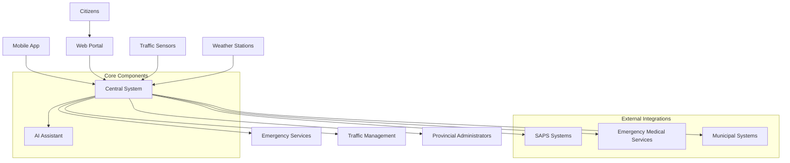
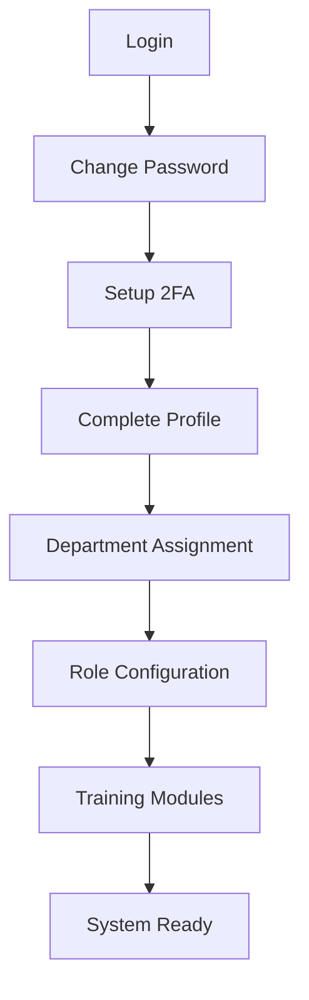
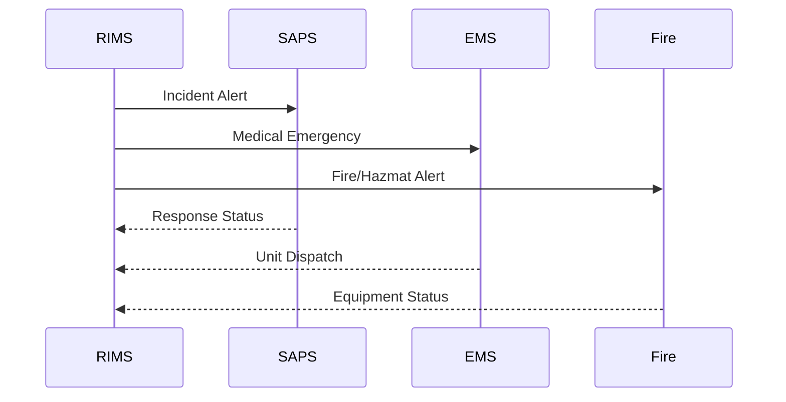
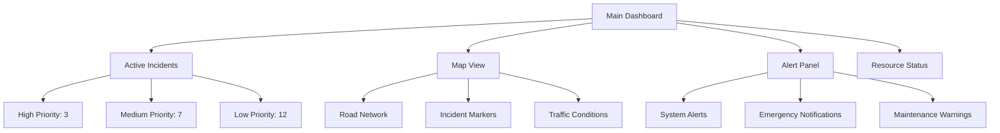
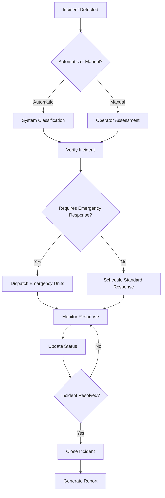
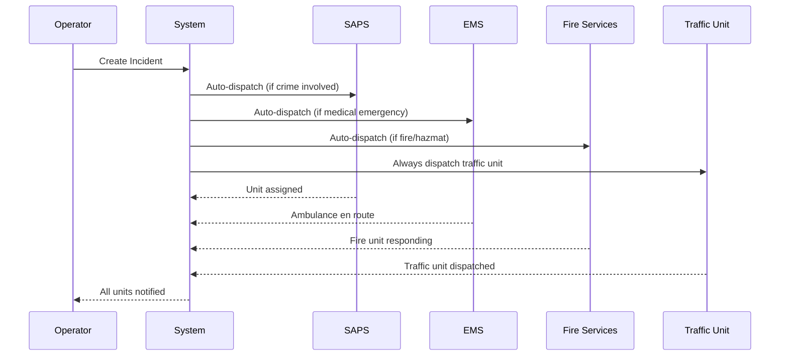

# Road Incident Management System
## User Manual for Mpumalanga Province Government

**Version 1.0**  
**Date: December 2024**  
**Prepared for: Mpumalanga Provincial Government**  
**Classification: Government Use Only**

---

## Table of Contents

1. [Introduction & Purpose](#1-introduction--purpose)
2. [Getting Started](#2-getting-started)
3. [Administrator User Guide](#3-administrator-user-guide)
4. [Operator Guide](#4-operator-guide)
5. [End-User Guide](#5-end-user-guide)
6. [AI Assistant Usage](#6-ai-assistant-usage)
7. [Troubleshooting](#7-troubleshooting)
8. [Frequently Asked Questions](#8-frequently-asked-questions)

---

## 1. Introduction & Purpose

### 1.1 System Overview

The Road Incident Management System (RIMS) is a comprehensive digital platform designed specifically for the Mpumalanga Provincial Government to enhance road safety and incident response capabilities across the province's extensive road network. This system provides real-time monitoring, automated emergency response coordination, and comprehensive safety audit management.

### 1.2 Purpose and Benefits

**Primary Objectives:**
- Reduce incident response times by up to 40%
- Improve road safety through proactive monitoring
- Streamline emergency service coordination
- Enhance data-driven decision making
- Ensure regulatory compliance and documentation
- Optimize resource allocation across the province

**Key Benefits for Mpumalanga Province:**
- **Enhanced Public Safety**: Faster emergency response and proactive incident prevention
- **Cost Efficiency**: Optimized resource deployment and reduced operational costs
- **Regulatory Compliance**: Automated compliance tracking with national road safety standards
- **Data-Driven Insights**: Comprehensive analytics for informed policy decisions
- **Improved Coordination**: Seamless integration between departments and emergency services

### 1.3 Target Users

- **Provincial Traffic Department Personnel**
- **Emergency Services Coordinators**
- **Road Maintenance Teams**
- **Safety Audit Inspectors**
- **Provincial Government Administrators**
- **Citizens of Mpumalanga Province**

### 1.4 System Architecture

---

## 2. Getting Started

### 2.1 System Requirements

**Web Browser Requirements:**
- Google Chrome 90+ (Recommended)
- Mozilla Firefox 88+
- Microsoft Edge 90+
- Safari 14+ (macOS/iOS)

**Mobile Application:**
- Android 8.0+ (API level 26)
- iOS 12.0+
- Minimum 2GB RAM
- 500MB available storage

**Network Requirements:**
- Stable internet connection (minimum 1Mbps)
- Offline capability available for field operations
- VPN access for government networks

### 2.2 Initial Access and Setup

#### 2.2.1 Obtaining System Access

1. **Request Access**: Contact your department's IT administrator
2. **Complete Security Clearance**: Ensure appropriate security clearance level
3. **Receive Credentials**: Obtain username and temporary password
4. **Accept Terms**: Review and accept government usage policies

#### 2.2.2 First-Time Login

1. Navigate to the system URL provided by your administrator
2. Enter your username and temporary password
3. Complete mandatory password change (must meet government security standards)
4. Set up two-factor authentication (2FA) using your government-issued device
5. Complete the security awareness training module

#### 2.2.3 Profile Setup

### 2.3 Navigation Overview

The system uses a role-based interface that adapts to your responsibilities:

**Main Navigation Menu:**
- **Dashboard**: Overview of current incidents and system status
- **Incidents**: Incident management and reporting
- **Mapping**: Interactive road network visualization
- **Safety Audits**: Comprehensive audit management
- **Reports**: Analytics and compliance reporting
- **Administration**: System configuration (admin users only)
- **Help**: Documentation and AI assistant access

### 2.4 User Roles and Permissions

| Role | Permissions | Typical Users |
|------|-------------|---------------|
| **Administrator** | Full system access, user management, configuration | IT Managers, System Administrators |
| **Supervisor** | Department oversight, approval workflows, reporting | Department Heads, Senior Traffic Officers |
| **Operator** | Incident management, dispatch, monitoring | Traffic Controllers, Emergency Coordinators |
| **Inspector** | Safety audits, field inspections, compliance | Safety Inspectors, Field Officers |
| **Viewer** | Read-only access, basic reporting | Management, External Stakeholders |
| **Citizen** | Incident reporting, status updates | General Public |

---

## 3. Administrator User Guide

### 3.1 System Administration Overview

Administrators have full control over system configuration, user management, and integration settings. This section covers the essential administrative functions required for system operation and maintenance.

### 3.2 User Management

#### 3.2.1 Creating New Users

1. Navigate to **Administration > User Management**
2. Click **Add New User**
3. Complete the user information form:
   - **Personal Details**: Full name, employee number, department
   - **Contact Information**: Email, mobile number, office phone
   - **Security Settings**: Username, role assignment, security clearance level
   - **Department Assignment**: Primary and secondary departments
4. Set **Account Status** and **Access Level**
5. **Save** and generate welcome email with temporary credentials

#### 3.2.2 Role Management

**Creating Custom Roles:**

**Standard Role Permissions Matrix:**

| Function | Admin | Supervisor | Operator | Inspector | Viewer |
|----------|--------|------------|----------|-----------|--------|
| User Management | ✓ | ✗ | ✗ | ✗ | ✗ |
| System Configuration | ✓ | ✗ | ✗ | ✗ | ✗ |
| Incident Creation | ✓ | ✓ | ✓ | ✓ | ✗ |
| Emergency Dispatch | ✓ | ✓ | ✓ | ✗ | ✗ |
| Safety Audit Management | ✓ | ✓ | ✗ | ✓ | ✗ |
| Report Generation | ✓ | ✓ | ✓ | ✓ | ✓ |

#### 3.2.3 Bulk User Operations

**Importing Users from CSV:**
1. Download the user template from **Administration > Templates**
2. Complete the spreadsheet with user information
3. Validate data format and mandatory fields
4. Import via **Administration > Bulk Import > Users**
5. Review import summary and resolve any errors
6. Confirm import and send welcome notifications

### 3.3 System Configuration

#### 3.3.1 General Settings

**Essential Configuration Items:**
- **System Name and Branding**: Customize for Mpumalanga Province
- **Time Zone**: South Africa Standard Time (SAST)
- **Language Settings**: English and local language support
- **Contact Information**: Emergency services, helpdesk details
- **Legal and Compliance**: Terms of use, privacy policies

#### 3.3.2 Integration Management

**Emergency Services Integration:**

**Configuration Steps:**
1. **API Configuration**: Set up secure connections to external systems
2. **Data Mapping**: Configure field mapping between systems
3. **Authentication**: Establish secure authentication protocols
4. **Testing**: Conduct integration testing with live systems
5. **Monitoring**: Set up integration health monitoring

#### 3.3.3 Notification Configuration

**Multi-Channel Notification Setup:**
- **SMS Gateway**: Configure bulk SMS provider
- **Email System**: SMTP configuration for government domain
- **Mobile Push**: Configure mobile app notifications
- **Dashboard Alerts**: Real-time system notifications
- **External APIs**: Integration with municipal alert systems

### 3.4 Data Management and Backup

#### 3.4.1 Backup Configuration

**Automated Backup Settings:**
- **Frequency**: Daily incremental, weekly full backup
- **Retention**: 30 days online, 12 months archive
- **Storage Location**: Government-approved cloud storage
- **Encryption**: AES-256 encryption for all backup data
- **Testing**: Monthly backup restoration testing

#### 3.4.2 Data Archiving

**Archiving Policy:**
- **Active Data**: Current incidents and audits (6 months)
- **Historical Data**: Completed incidents (2 years online)
- **Archive Storage**: Long-term storage (7 years)
- **Legal Compliance**: Maintain records per government requirements

### 3.5 Security Administration

#### 3.5.1 Security Policies

**Password Policy Configuration:**
- Minimum 12 characters
- Complex character requirements
- 90-day expiration
- No password reuse (last 12 passwords)
- Account lockout after 5 failed attempts

**Session Management:**
- 8-hour maximum session duration
- Automatic logout after 30 minutes inactivity
- Concurrent session limits
- IP-based access restrictions

#### 3.5.2 Audit and Compliance

**Security Audit Logging:**
- User login/logout events
- Data access and modification
- Configuration changes
- Failed authentication attempts
- Privilege escalation events

**Compliance Reporting:**
- Monthly security reports
- Access certification reviews
- Vulnerability assessments
- Compliance dashboard monitoring

---

## 4. Operator Guide

### 4.1 Operator Role Overview

Operators are the primary users responsible for day-to-day incident management, emergency response coordination, and real-time monitoring of the road network. This section provides comprehensive guidance for operational procedures and best practices.

### 4.2 Dashboard and Monitoring

#### 4.2.1 Main Dashboard Layout

The operator dashboard provides real-time situational awareness:

**Dashboard Components:**
- **Incident Summary**: Active incidents by severity and type
- **Map View**: Real-time road network with incident markers
- **Alert Panel**: System notifications and emergency alerts
- **Weather Panel**: Current weather conditions affecting roads
- **Resource Status**: Available emergency units and equipment
- **Performance Metrics**: Response times and key indicators

#### 4.2.2 Real-Time Monitoring

**Monitoring Protocols:**
1. **Continuous Monitoring**: Check dashboard every 5 minutes
2. **Alert Response**: Acknowledge alerts within 2 minutes
3. **Status Updates**: Update incident status every 15 minutes
4. **Communication**: Maintain radio contact with field units
5. **Documentation**: Log all actions in the incident record

### 4.3 Incident Management

#### 4.3.1 Incident Detection and Classification

**Automated Detection Sources:**
- Traffic sensor alerts
- CCTV system analysis
- Weather station warnings
- Citizen reports via mobile app
- Emergency service notifications
- AI pattern recognition

**Incident Classification System:**

| Priority Level | Response Time | Examples | Required Actions |
|----------------|---------------|----------|------------------|
| **Critical** | < 5 minutes | Fatalities, major accidents, road closures | Immediate dispatch, senior notification |
| **High** | < 15 minutes | Injuries, hazardous conditions, traffic disruption | Emergency response, traffic management |
| **Medium** | < 30 minutes | Minor accidents, vehicle breakdowns | Standard response, assistance dispatch |
| **Low** | < 60 minutes | Road maintenance needs, minor hazards | Non-emergency response, scheduling |

#### 4.3.2 Incident Workflow

#### 4.3.3 Creating Manual Incidents

**Step-by-Step Process:**

1. **Access Incident Creation**:
   - Click **New Incident** on dashboard
   - Or use **Incidents > Create New**

2. **Basic Information**:
   - **Location**: Select from map or enter coordinates
   - **Type**: Choose from predefined categories
   - **Severity**: Assess using classification guidelines
   - **Description**: Detailed incident description

3. **Additional Details**:
   - **Weather Conditions**: Current weather impact
   - **Traffic Impact**: Lane closures, diversions
   - **Hazards Present**: Specific safety concerns
   - **Resources Needed**: Emergency services required

4. **Verification and Dispatch**:
   - Review all information for accuracy
   - Confirm location using map verification
   - Dispatch appropriate emergency services
   - Set initial estimated resolution time

### 4.4 Emergency Response Coordination

#### 4.4.1 Dispatch Procedures

**Emergency Service Coordination:**

**Dispatch Checklist:**
- [ ] Verify incident location accuracy
- [ ] Confirm incident type and severity
- [ ] Check weather and traffic conditions
- [ ] Select appropriate response units
- [ ] Verify unit availability
- [ ] Send dispatch notifications
- [ ] Monitor response acknowledgments
- [ ] Update estimated arrival times

#### 4.4.2 Communication Protocols

**Radio Communication Guidelines:**
- Use clear, concise language
- Confirm all instructions received
- Update central control every 15 minutes
- Report any changes in incident status
- Coordinate with other response units

**Standard Radio Codes:**
- **Code 1**: Non-emergency response
- **Code 2**: Urgent response (no lights/sirens)
- **Code 3**: Emergency response