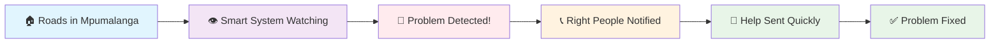
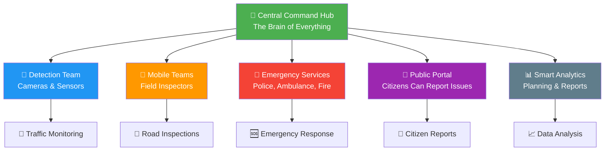
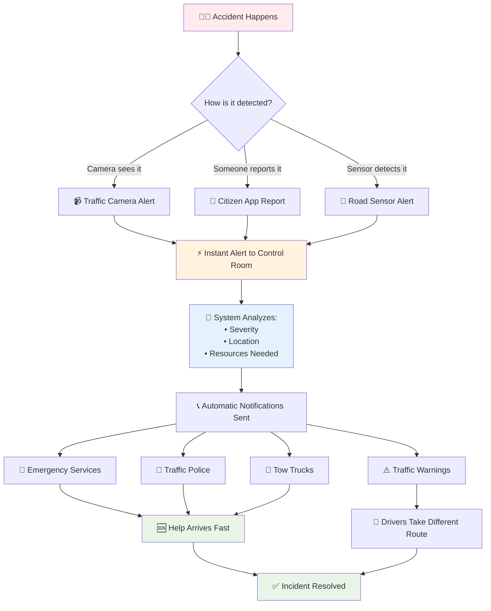
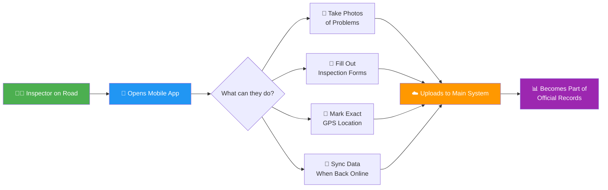
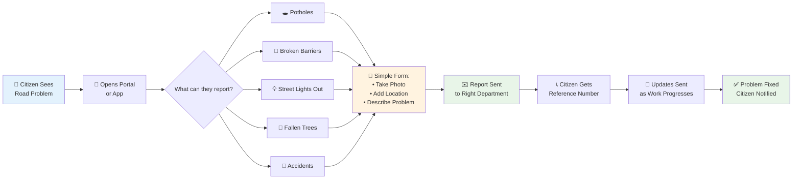
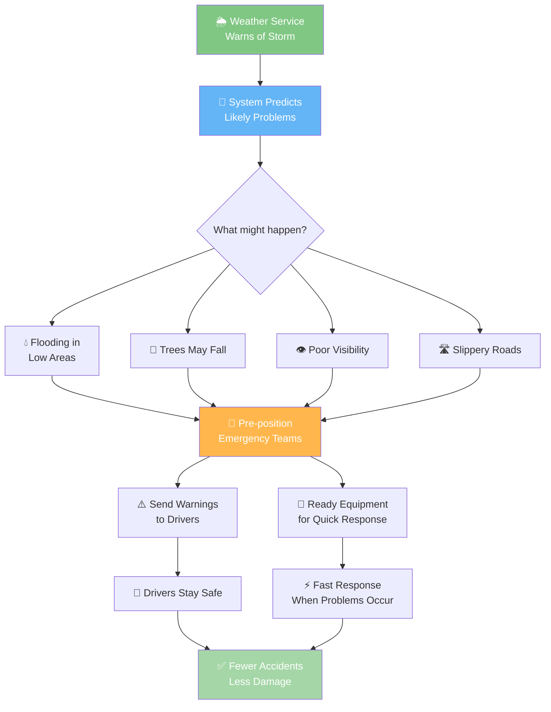
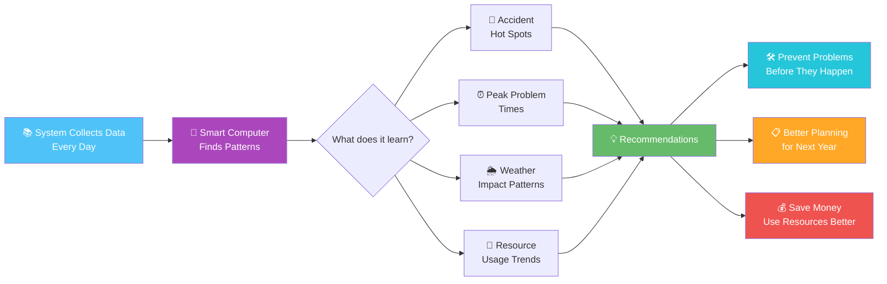
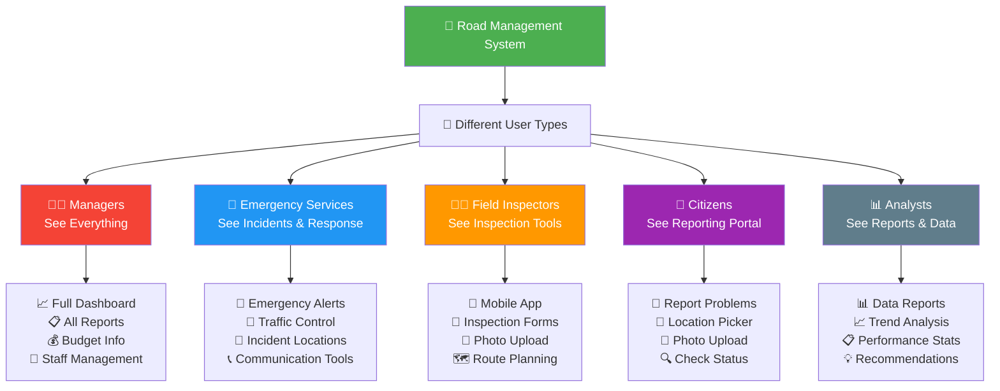
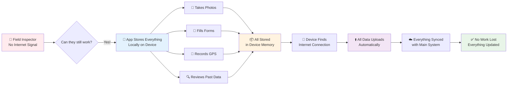

# 🚗 Road Incident Management System
## A Simple Visual Guide for Mpumalanga Province

---

## What Is This System? 🤔

Think of this system like having a super-smart friend watching all the roads in Mpumalanga 24/7. When something goes wrong - like a car accident, a pothole, or a traffic jam - this friend immediately knows about it and calls the right people to help.



---

## How Does It Work? The Big Picture 🔄

Just like your smartphone can do many things at once, our road system has different parts working together. It's like having a team of specialists all talking to each other through one smart hub.



---

## What Happens When There's An Accident? 🚨

Imagine you're driving and see a car accident. Before you can even pick up your phone, our system has already detected it and started helping. Here's how it works, step by step:



The best part? This all happens in minutes, not hours. It's like having a guardian angel for every road in Mpumalanga.

---

## The Mobile App - Your Road Inspector's Best Friend 📱

Think of the mobile app like WhatsApp, but specifically for road problems. Field inspectors carry tablets that work even without internet connection - perfect for remote areas in Mpumalanga.



---

## Real-World Example: A Day in the Life 📅

Let me tell you about Sarah, a traffic official, and how this system helps her every day:

**Morning:** Sarah opens her dashboard and sees a map of all roads in Mpumalanga. Green roads are fine, yellow ones need attention, and red ones have problems.

```mermaid
gantt
    title Sarah's Day with the Road System
    dateFormat HH:mm
    axisFormat %H:%M
    
    section Morning
    Check Dashboard        :done, a1, 08:00, 08:15
    Review Overnight Incidents :done, a2, 08:15, 08:30
    Plan Day's Inspections :done, a3, 08:30, 09:00
    
    section Field Work
    Drive to Problem Area  :active, b1, 09:00, 10:00
    Use Mobile App        :b2, 10:00, 12:00
    Document Issues       :b3, 12:00, 13:00
    
    section Afternoon
    Emergency Response    :crit, c1, 13:30, 14:30
    Report Writing        :c2, 14:30, 16:00
    Plan Tomorrow         :c3, 16:00, 17:00
```



**Afternoon:** An emergency call comes in - truck rollover on the N4. The system immediately shows Sarah the best route to get there and has already called the ambulance and tow truck.

---

## The Citizen Portal - How Regular People Help 👥

Just like you can order food on an app, citizens can report road problems through our portal. It's that simple!



Citizens become the extra eyes and ears of the system, helping keep all roads safe.

---

## What Happens During Bad Weather? 🌧️

The system is like having a weather-smart assistant that knows when rain, fog, or storms might cause problems. It prepares everything in advance.



---

## Smart Analytics - Learning from Data 📊

Think of this like Netflix learning what movies you like, but for roads. The system learns from every incident to prevent future problems.



For example, if the system notices lots of accidents happen at a specific curve when it rains, it can recommend better drainage or warning signs.

---

## Who Uses What? Role-Based Access 🎭

Just like different keys open different doors, different people see different parts of the system based on their job.



---

## What Happens When Internet Goes Down? 📶

In rural Mpumalanga, internet can be spotty. But don't worry - the system works like a smartphone that stores photos until you get signal again.



This means inspectors can work anywhere in the province without worrying about cell phone towers.

---

## Safety Audits Made Simple 🔍

Think of safety audits like a doctor's check-up for roads. The system helps inspectors be thorough and organized, like having a smart checklist that never forgets anything.

```mermaid
graph TD
    A[🛣️ Time for Road<br/>Safety Audit] --> B[📋 System Creates<br/>Custom Checklist]
    
    B --> C{What gets checked?}
    
    C --> D[🛑 Signs & Signals<br/>• Visibility<br/>• Condition<br/>• Placement]
    
    C --> E[🛤️ Road Surface<br/>• Cracks<br/>• Potholes<br/>• Markings]
    
    C --> F[🚧 Safety Features<br/>• Barriers<br/>• Lighting<br/>• Drainage]
    
    C --> G[🌳 Environment<br/>• Trees<br/>• Visibility<br/>• Weather Impact]
    
    D --> H[📱 Inspector Uses<br/>Mobile Checklist]
    E --> H
    F --> H
    G --> H
    
    H --> I[📸 Photos for<br/>Each Issue Found]
    
    I --> J[📊 Automatic Risk<br/>Rating Generated]
    
    J --> K[📋 Official Report<br/>Created Instantly]
    
    K --> L[📞 Notifications Sent<br/>to Right People]
    
    L --> M[🔨 Repairs<br/>Scheduled & Tracked]
    
    style A fill:#4caf50,color:#fff
    style H fill:#2196f3,color:#fff
    style J fill:#ff9800,color:#fff
    style K fill:#9